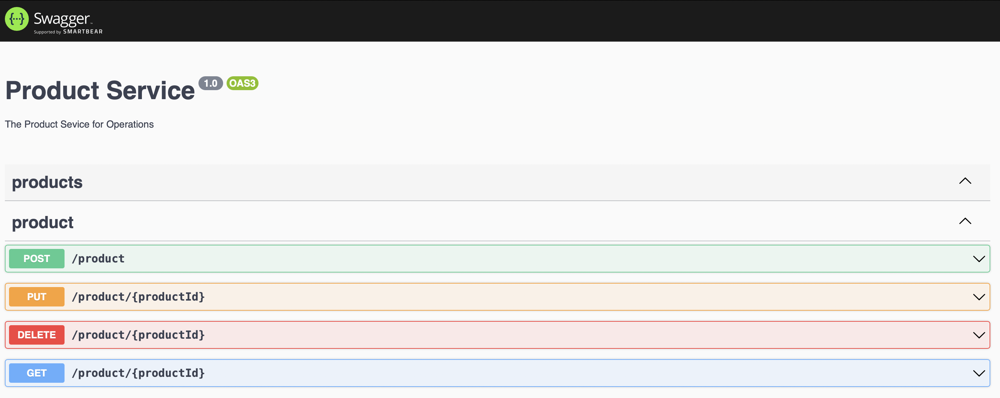

# Product Service

Product Service

---
## Requirements

For development, you will only need Node.js and a node global package, installed in your environement.

### Node
- #### Node installation on macOS

  You can install nodejs and npm easily with apt install, just run the following commands.

      $ brew install nodejs
      $ brew install --cask docker

- #### Other Operating Systems
  You can find more information about the installation on the [official Node.js website](https://nodejs.org/) and the [official Docker website](https://docker.com/).

If the installation was successful, you should be able to run the following command.

    $ node --version
    v12.22.10

    $ npm --version
    6.14.16

---

## Install

    $ git clone https://github.com/tayfunyasar/productservice
    $ cd productservice
    $ npm i

## Configure app

Open `.env` then edit it with your settings. You will need:

- AWS config parameters

```
AWS_ACCESS_KEY="youraccesskey"
AWS_SECRET_KEY="yoursecretkey"
REGION="yourregion"

SQS_QUEUE_URL="yourqueueurl"
SQS_WAIT_TIME_SECONDS=10
DYNAMODB_URL="yourdburl"
```

## Running the project

    $ docker-compose up
    $ npm run start:dev

> open your browser with: http://localhost:3000/



## Simple build for production

    $ npm run build

### developer
- Tayfun YAŞAR
- tayfun@tayfunyasar.com

 -- outbox pattern
 -- fault tolerant 